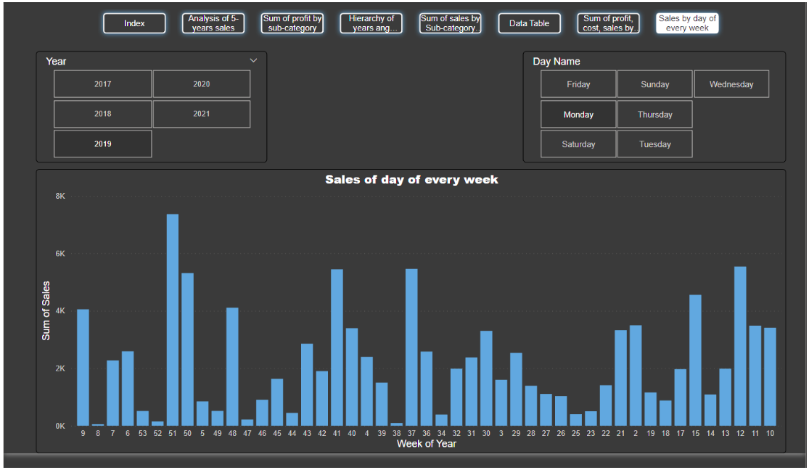
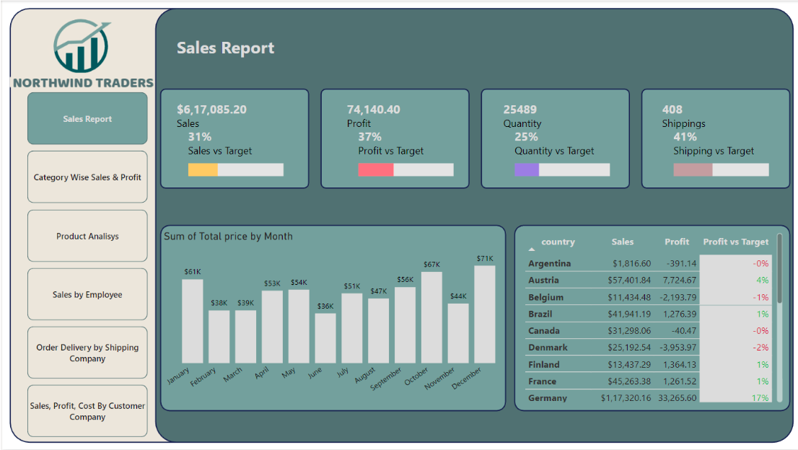
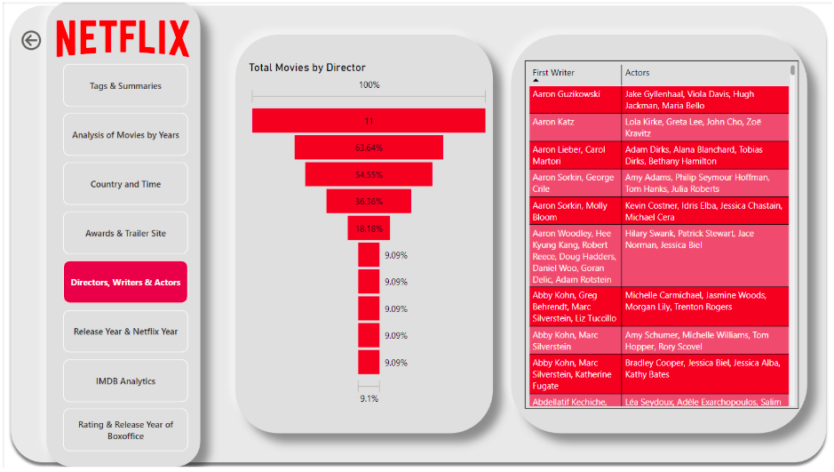
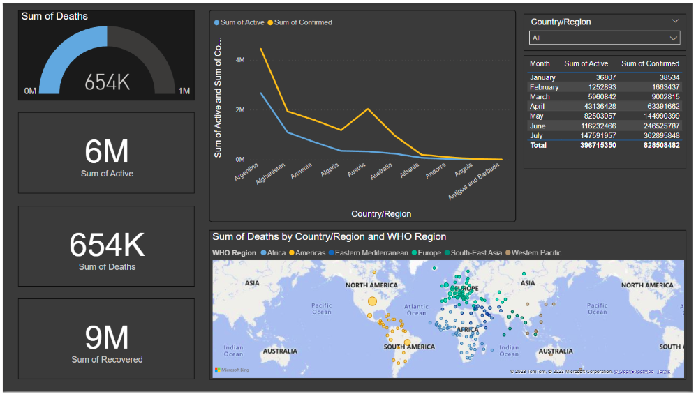
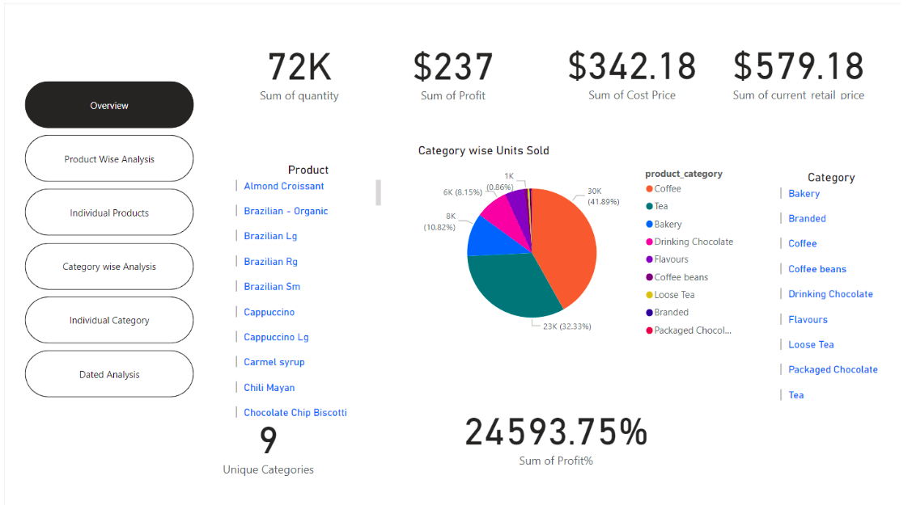

# Power BI Dashboard Projects

This repository contains Power BI dashboards created using multiple real-world datasets. The projects demonstrate data cleaning, data modeling, DAX calculations, visualization design, and interactive dashboard development.

---

# Assignment

## Objective

Understand, clean, and analyze an e-commerce dataset using Power BI by applying data transformation, DAX calculations, and interactive visualizations.

## Dataset

**Name:** Sample PBI Practice Dataset

**Type:** E-Commerce Orders and Sales Dataset

### Available Tables

- Orders
- Returns
- People

---

## Project Requirements

- Understand the dataset structure
- Clean and transform data using Power Query
- Create relationships between tables
- Build hierarchies
- Create calculated columns and measures using DAX
- Design interactive dashboards
- Publish the report to Power BI Service

---

## Operations Performed

### 1. Data Understanding

- Explored dataset structure
- Identified relationships
- Understood business requirements

### 2. Data Cleaning (Power Query)

- Changed column data types
- Promoted headers
- Handled null values
- Added supporting columns

### 3. Data Modeling

- Verified existing relationships
- Created new relationships
- Managed cardinality
- Configured cross-filter directions

### 4. Hierarchies

Created hierarchies for:

- Date
- Product
- Quantity
- City

Implemented:

- Drill Down
- Drill Through

### 5. DAX Calculations

Examples include:

- Total Profit
- Profit Percentage
- Total Quantity
- Profit by Date
- Sales on Mondays of every 4th week
- Various business metrics

### 6. Dashboard Design

Used visualizations such as:

- Line Charts
- Clustered Bar Charts
- Cards
- Slicers
- Navigation Buttons
- Filters

### 7. Power BI Service

- Published report
- Created workspace
- Managed user access
- Built dashboard

---

# Assignment Dashboard

Replace the image path below with your own screenshot.





---

# Projects

## 1. Northwind Traders Dashboard

### Overview

Developed an interactive dashboard using the Northwind Traders sample database.

### Key Tasks

- Data Cleaning
- Relationship Management
- DAX Measures
- Dashboard Design
- Interactive Visualizations

### Snapshot




---

## 2. Netflix Dashboard

### Overview

Built an interactive dashboard to analyze Netflix content.

### Features

- Content Distribution
- Release Trends
- Genre Analysis
- Country-wise Analysis
- Interactive Filters

### Snapshot





---

## 3. COVID-19 Dashboard

### Overview

Analyzed worldwide COVID-19 data using Power BI.

### Metrics

- Total Cases
- Active Cases
- Recoveries
- Deaths
- Country-wise Analysis
- WHO Region Analysis

### Snapshot





---

## 4. Coffee Shop Dashboard

### Overview

Created a dashboard to analyze coffee shop sales and business performance.

### Features

- Sales Analysis
- Product Performance
- Revenue Tracking
- Customer Insights
- Interactive Reports

### Snapshot





---

# Skills Demonstrated

- Power BI Desktop
- Power Query
- Power Pivot
- Data Modeling
- DAX
- Data Cleaning
- Dashboard Design
- Interactive Reports
- Business Intelligence
- Data Visualization

---

# Tools Used

- Power BI Desktop
- Power Query
- DAX
- Power BI Service

---

# Repository Structure

```
.
├── README.md
├── images/
│   ├── assignment-dashboard.png
│   ├── northwind-dashboard.png
│   ├── netflix-dashboard.png
│   ├── covid-dashboard.png
│   └── coffee-dashboard.png
└── PowerBI Files/
```
